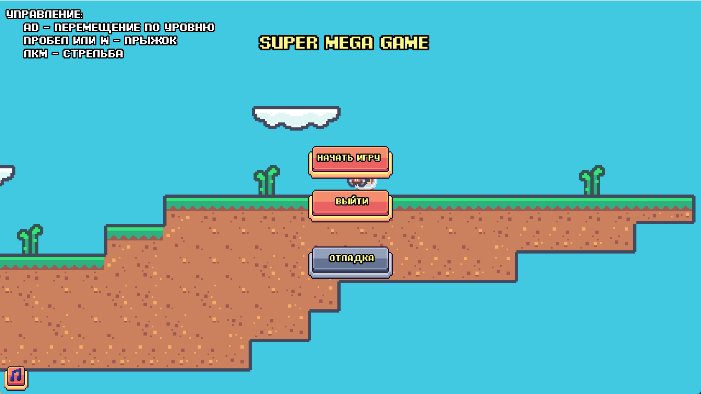
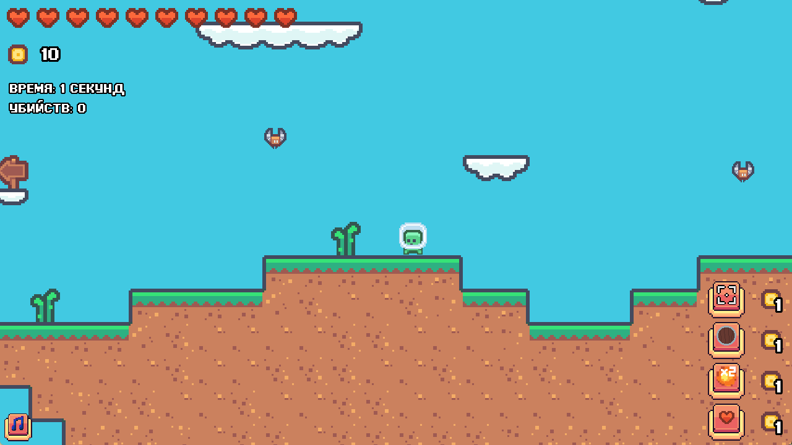
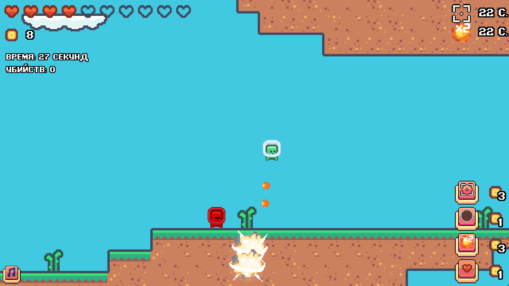

## What is this?
This is a simple game written in Python using Pygame Zero, focused to be a roguelike game.
The goal of this project was to write a simple game only using Pygame Zero in 3 days. I release it here just so anyone who's interested in pygame development can look at it. 

There are a lot of things that I'd love to change and/or improve, mainly optimization, or bugs which're present there, and maybe I'll do it someday, but I'm gonna leave it like that for now. The whole game is in russian, but all code comments are in english (sorry for all possible weirdness that can be found in those comments, 5am is not a good time for codding :D)

## Screenshots
# Main menu

# Gameplay

